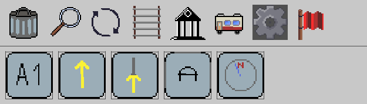
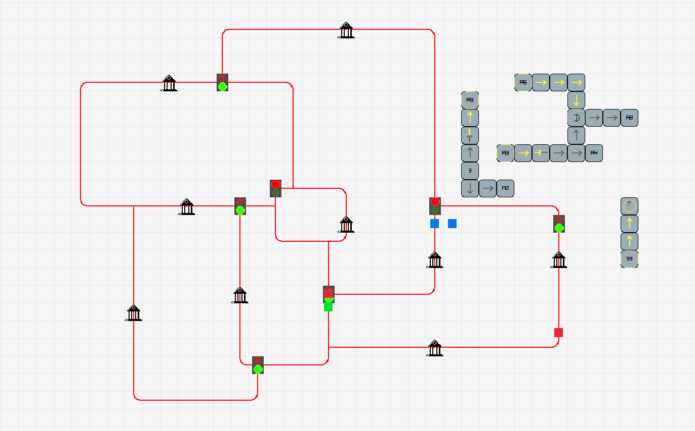

# 🚂 TrainBuilder

**A railway logic game where you build circuits with trains!**

---

## 🎮 What is TrainBuilder?

TrainBuilder is a **sandbox railway simulation** where you don't just build tracks – you build LOGIC. Create complex signal systems, program train behaviors, and watch your railway come alive!

Unlike other train games, TrainBuilder focuses on **programmable logic**: use AND/XOR gates, signal nodes, and conductors to create anything from simple crossing guards to fully automated railway networks.

---

## ✨ Features

### 🛤️ Track Building
- Place tracks, curves, crossings
- Automatic track connection system
- Build straight lines with click & drag

### 🚦 Signals & Logic
- **AND / XOR gates** – build real circuits
- **Inverters** – flip signals
- **Nodes** – read or write signals with custom IDs
- **Conductors** – directional signal transmission
- **Traffic lights** – controlled by your logic

### 🚂 Trains & Scheduling
- Multiple train types with different speeds
- **NAVI block** – dynamically add/remove stations from train schedules
- Pathfinding (BFS) with obstacle avoidance
- Trains wait at red signals
- Drag & drop timetable editor

### 🗺️ World Management
- Multiple worlds with save/load system
- Create, rename, delete worlds
- Example world included
- All data stored in JSON – easy to edit!

### 🎨 UI & Comfort
- Scrollable side menus
- Tooltips for all items
- Marker system with off-screen indicators
- Camera zoom & pan
- Mouse cursor feedback

---

## 📸 Screenshots

---

## 🎯 What makes TrainBuilder special?

**It's not just a train game – it's a LOGIC game.**

With the ID-based signal system, you can:
- Build 1-bit memory cells with trains and stations
- Create counters, comparators, and adders
- Program conditional train behaviors
- Build entire computers inside your railway network!

Your trains become the bits, your stations become memory, and your logic gates become the processor. **It's Turing-complete!**

---

## 🎮 How to Play

### Quick Start
1. Download `TrainBuilder_v1.0.zip`
2. Extract anywhere
3. Run `TrainBuilder.exe`
4. Select "Example World" from the menu
5. Watch trains run or start building!

### Basic Controls
| Key/Mouse | Action |
|-----------|--------|
| W/A/S/D | Move camera |
| Mouse wheel | Zoom in/out |
| Left click | Place / select |
| ESC | Back to menu |

### Building Flow
1. **Tracks** – Click and drag to build straight lines
2. **Stations** – Place on tracks, give them IDs
3. **Signals** – Add traffic lights controlled by logic
4. **Logic** – Use nodes, conductors, gates to create circuits
5. **Trains** – Place trains, create schedules with NAVI blocks

---

## 🛠️ Built With

- **C++** – Core language
- **Raylib** – Graphics and input
- **nlohmann/json** – JSON serialization

---

## 📦 Download

| Version | File | Size |
|---------|------|------|
| v1.0 (Windows) | [TrainBuilder_v1.0.zip](https://github.com/Hannes-swd/TrainBuilder/releases/tag/TrainSim) | ~XX MB |

---

## 📝 License

This project is open source – feel free to explore, modify, and share!

---

## 🙏 Thanks

- Raylib community for the amazing library
- Everyone who gave feedback during development
- **You** for checking out TrainBuilder!

---

**Happy building! May your trains always run on time!** 🚂✨

---

*P.S. – This is my second completed Raylib game. If I can do it, you can too!*
